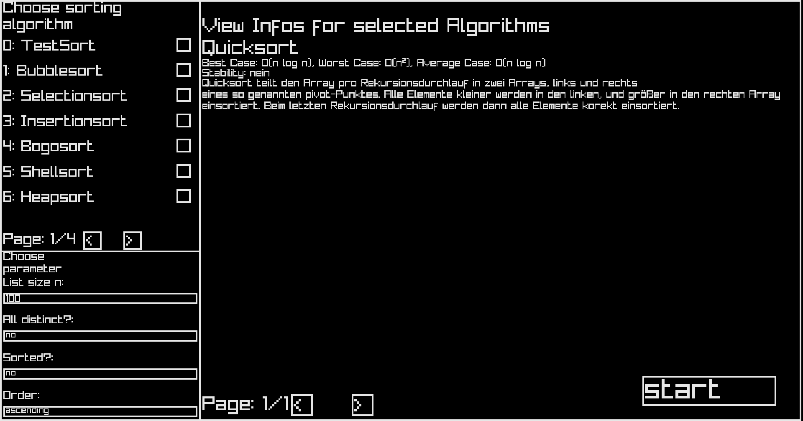
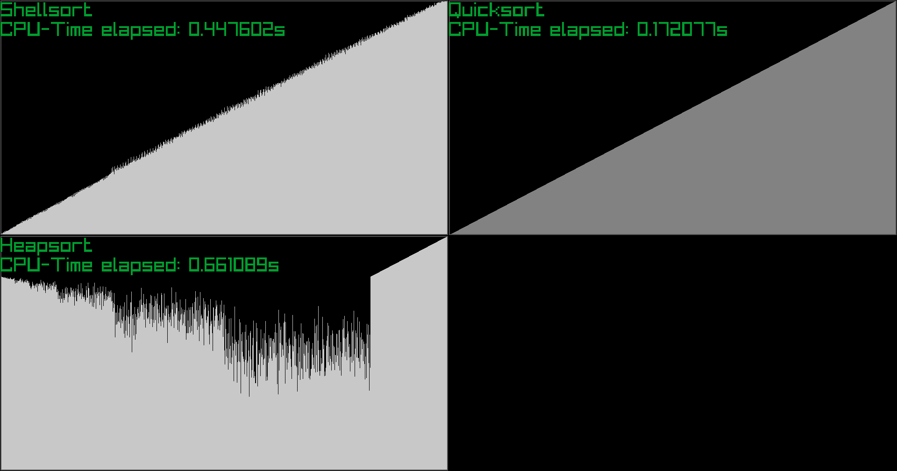
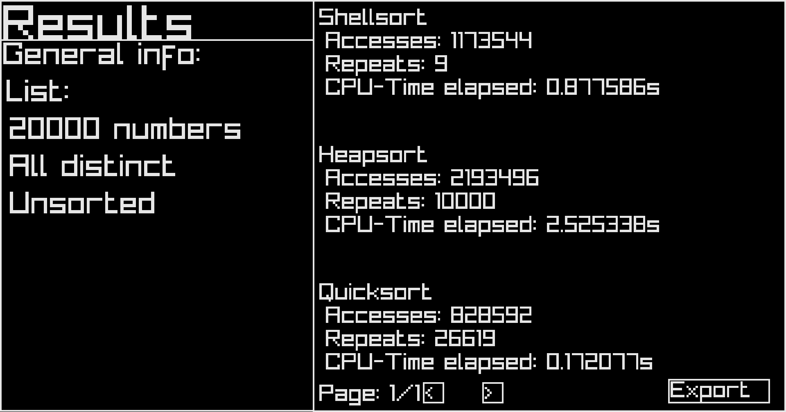

# ap-visual-sorting
Dieses Softwareprojekt erlaubt die Visualisierung, Benchmarking und Vergleich von Sortieralgorithmen, vollständig in C umgesetzt mit GUI!

# Verwendung
Run the executable `MySorter` from the release or build your own from the C source code with the Makefile:

```
cd ap-visual-sorting
make 
./MySorter
```
# Hilfe
- raylib beispiele:     https://www.raylib.com/examples.html
- raylib funktionen:    https://www.raylib.com/cheatsheet/cheatsheet.html
- threads:              https://www.geeksforgeeks.org/c/multithreading-in-c/
- mischen:              https://www.studysmarter.de/studium/informatik-studium/datenverarbeitung/shuffling-algorithmen/

# Abhängigkeiten
--> Raylib halt

# Bilder




